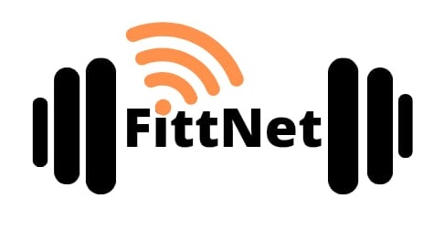

<p align='left'>
    
</p>

# Proyecto Grupal - Henry - Equipo 11 - FittNet

<p align="left">
  
</p>

## Objetivos del Proyecto

- Construir una App utlizando React, Redux, Node y Sequelize.
- Afirmar y conectar los conceptos aprendidos en la carrera.
- Aprender mejores prácticas.
- Aprender y practicar el workflow de GIT.
- Usar y practicar testing.


## BoilerPlate

El boilerplate cuenta con dos carpetas: `api` y `client`. En estas carpetas estará el código del back-end y el front-end respectivamente.

En `api` crear un archivo llamado: `.env` que tenga la siguiente forma:

```
DB_USER=usuariodepostgres
DB_PASSWORD=passwordDePostgres
DB_HOST=localhost
```

Reemplazar `usuariodepostgres` y `passwordDePostgres` con tus propias credenciales para conectarte a postgres. Este archivo va ser ignorado en la subida a github, ya que contiene información sensible (las credenciales).

Adicionalmente será necesario que creen desde psql una base de datos llamada `fittNet`

El contenido de `client` fue creado usando: Create React App.

## Integrantes del Equipo

• Jessica Longo
• Luis Lescano
• Carlos Acevedo
• Martín Luis
• Sebastián Garcia
• Esteban Villalba
• Fernando Segovia

## Problema u oportunidad que resuelve:

Tiene como idea original brindar una solución a todos aquellos gimnasios, centros de entrenamiento y alumnos que quieran acercar la tecnología a sus procesos, para esto se plantea un sistema en plataforma Web, donde se conecta a cada alumno con su entrenador o gimnasio para poder llevar adelante su rutina o entrenamiento de forma más eficiente y también poder elegir los gimnasios que están adheridos a la plataforma. En su concepción, es un nuevo producto que viene a cubrir un déficit en el mercado, pero que también será construido teniendo en cuenta la experiencia recopilada de organizaciones del rubro que necesitan cubrir sus requerimientos y no tienen ninguna herramienta que les brinde soporte, o tienen, pero no lo hace en su totalidad.

## Objetivo del proyecto:

Permite que los ciudadanos y dueños de centros de entrenamiento accedan a oportunidades únicas de todo el mundo mediante una plataforma de gestión de actividades, lugares disponibles y medios colaborativos.
Mediante una plataforma web, brindar soporte a gimnasios y alumnos para que ellos elijan el sitio de entrenamiento. Donde los clientes forman parte de una colaboración con otros clientes para lograr una comunidad de centros de entrenamientos disponibles en una zona y necesarios

### Beneficiarios:

Está orientado a todos aquellos individuos que se encuentren interesados en realizar un entrenamiento y no importa el sitio en que estén, la plataforma les brindará los gimnasios adheridos y las actividades que pueden hacer en el mismo, teniendo sus planes en el sistema y pudiendo realizar la actividad si se mudan o están de viajes.
Dueños de gimnasios que busquen una plataforma para expandir sus suscripciones, ampliar su clientela y tener un mejor control de administración de sus clientes mediante la plataforma.

### Objetivo del sistema de información:

Brindar soporte e información a usuarios y dueños de gimnasios sobre la administración de planes, gestión de personal, seguimiento de entrenamiento, gimnasios y entrenadores disponibles, como así también la gestión de nuevos usuarios y pagos de mensualidades.

#### Tecnologías necesarias:
- [ ] React
- [ ] Redux
- [ ] Express
- [ ] Sequelize - Postgres

#### Frontend

Se debe desarrollar una aplicación de React/Redux que contenga las siguientes pantallas/rutas.

__Pagina inicial__: deben armar una landing page 

__Ruta principal__: debe contener
- [ ] Input de búsqueda 
- [ ] Área donde se verá el listado de gimnasios. 
- [ ] Botones/Opciones para filtrar 
- [ ] Botones/Opciones para ordenar 
- [ ] Paginado para ir buscando y mostrando las siguientes opciones

__Ruta de detalle__: debe contener
- [ ] Logo del Gimnasio
- [ ] Principales promociones
- [ ] Direccion

#### Base de datos


#### Backend

Se debe desarrollar un servidor en Node/Express con las siguientes rutas:


#### Testing